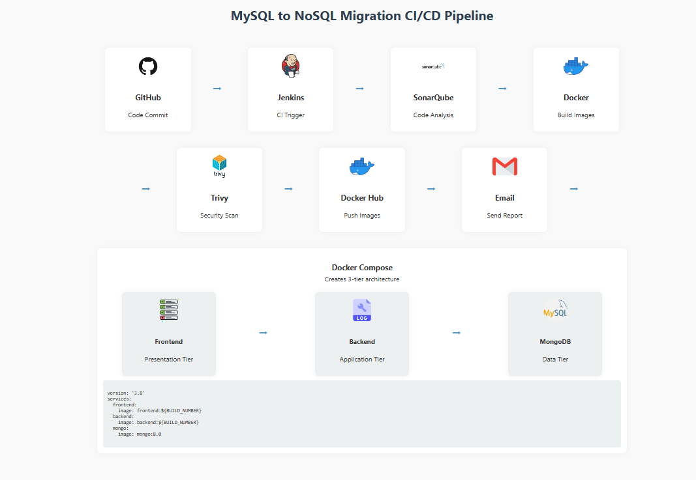
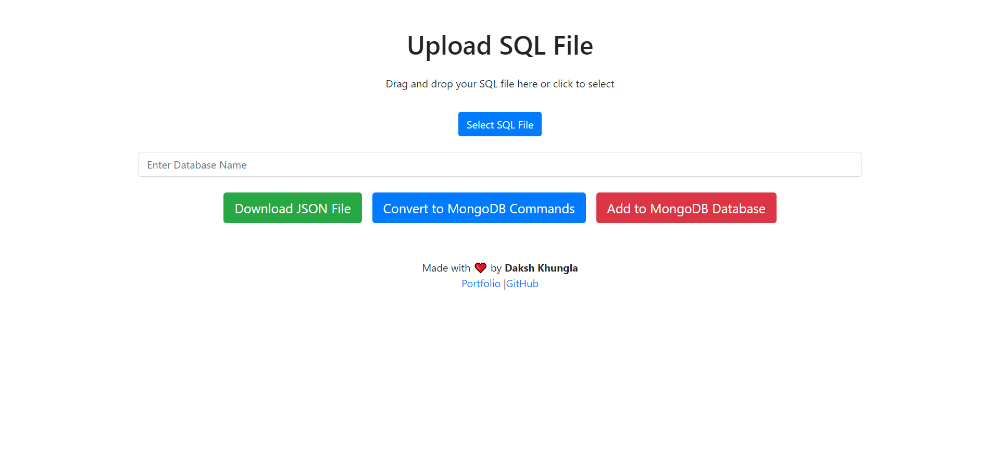

# MySQL-to-NoSQL

Effortless, automated migration from MySQL to MongoDB—integrated with a modern DevOps pipeline.

---

# 📺 Project Demo & Visual Overview

  
  

## 🚀 Overview

Migrating relational data to NoSQL can be complex and error-prone. This project automates the entire process: upload your `.sql` file and the system parses tables, infers primary/foreign keys, intelligently maps data to MongoDB collections, and preserves relationships. All of this is wrapped in a robust CI/CD pipeline for quality, security, and seamless delivery.

---

## ✨ Features

- **Upload & Convert:** Upload a MySQL `.sql` dump; the tool parses tables, primary keys, and relationships.
- **Automatic Mapping:** Converts relational schemas to MongoDB collections, mapping primary keys and references automatically.
- **No Manual Steps:** Generates and populates MongoDB collections—no scripts or manual intervention required.
- **DevOps Pipeline:** Integrated CI/CD with Jenkins, SonarQube, Trivy, and Docker for quality, security, and delivery.

---

## 🧰 Tech Stack

- **Frontend:** React
- **Backend:** Node.js
- **Databases:** MySQL, MongoDB
- **DevOps:** Jenkins, Docker, SonarQube, Trivy

---

## ⚙️ DevOps CI/CD Pipeline

- **Trigger:** Every GitHub commit starts the pipeline.
- **Stages:**
  - **Checkout:** Jenkins pulls the latest code.
  - **SonarQube Analysis:** Static code analysis for code quality and security.
  - **Build Docker Images:** Separate images for frontend and backend.
  - **Trivy Scan:** Security scan of Docker images.
  - **Push to Docker Hub:** Versioned images for frontend and backend.
  - **Automated Email:** Sends build, scan, and quality reports.
- **Deployment:** Docker Compose spins up frontend, backend, and MongoDB as separate containers.

---

## 🏁 Getting Started

### Prerequisites

- Docker & Docker Compose
- Node.js & npm
- Jenkins (for CI/CD)
- SonarQube & Trivy (for code and security analysis)
- MongoDB

