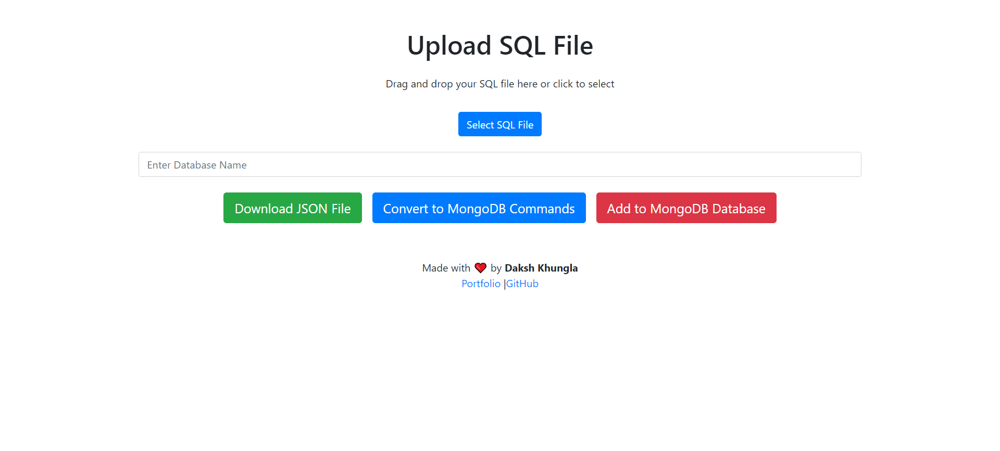

<h1>SQL to MongoDB NoSQL Converter</h1>

Welcome to the SQL to MongoDB NoSQL Converter! This tool automatically converts SQL scripts into MongoDB-compatible NoSQL JSON format. It processes your SQL file, supports foreign key relationships, and generates MongoDB commands to create collections and insert data into MongoDB. The tool is built using Node.js and can be easily integrated with MongoDB.

<h2>🚀 Key Features</h2>
<ul>
  <li><strong>Automatic SQL to MongoDB Conversion</strong> Transforms SQL database schema and data into MongoDB-compatible collections and documents.</li>
  <li><strong>Foreign Key Support</strong> Handles foreign key relationships by either embedding related documents or using MongoDB references.</li>
  <li><strong>Generates MongoDB Commands</strong> Creates MongoDB commands to set up collections and insert data directly into MongoDB.</li>
</ul>

<h2>🧩 How It Works</h2>
<h3>SQL Script Input</h3>

The tool reads SQL scripts containing:

<ul>
  <li>Schema definitions for table structures.</li>
  <li>Data insertion commands.</li>
</ul>

<h3>MongoDB JSON Output</h3>

The tool generates JSON data, suitable for MongoDB collections. MongoDB commands are also generated to automatically create collections and insert data into MongoDB.

<h3>Foreign Key Handling</h3>

Foreign key relationships are managed by:

<ul>
  <li>Embedding related data into parent documents.</li>
  <li>Creating references between collections when necessary.</li>
</ul>

<h2>🧑‍💻 Setup and Installation</h2>

To get started, ensure you have the following packages installed:

<ul>
  <li>Express - A web framework for Node.js to handle HTTP requests.</li>
  <li>MongoDB - MongoDB client to interact with your MongoDB database.</li>
  <li>FileSaver (React) - To save files on the client-side.</li>
  <li>CORS - To enable Cross-Origin Resource Sharing for your server.</li>
</ul>

<h2>📋 Prerequisites</h2>
<ul>
  <li>Node.js installed on your machine.</li>
  <li>MongoDB installed and running on your local machine or use a cloud MongoDB service.</li>
  <li>npm to manage packages.</li>
</ul>

<h2>🛠️ Installation</h2>
<pre><code>git clone https://github.com/yourusername/sql-to-mongodb.git
cd sql-to-mongodb
npm install</code></pre>

<h2>🧑‍💻 Usage</h2>
<ul>
  <li>Place your SQL file in the input folder.</li>
  <li>Run the Node server:</li>
</ul>

<pre><code>node server.js</code></pre>

The server will process the SQL file, automatically create the MongoDB-compatible JSON data, and generate MongoDB commands to insert the data into the database.

<h3>MongoDB Insertion</h3>

The generated MongoDB commands can be used to insert the data into MongoDB collections.

<h2>🌐 Server Configuration</h2>

<strong>CORS:</strong> Ensure that CORS is enabled for cross-origin requests if you're using this in a client-server architecture.

You can use the following code in the <code>server.js</code> to enable CORS:

<pre><code>const cors = require('cors');
app.use(cors());</code></pre>

<h3>🚀 Starting the Server</h3>

To start the Node.js server, use the following command:

<pre><code>node server.js</code></pre>

This will start the server, which processes your SQL files and generates MongoDB-compatible output.

<h2>🛠️ Dependencies</h2>
<ul>
  <li>Express: A fast, unopinionated web framework for Node.js.</li>
  <li>MongoDB: The MongoDB Node.js driver to interact with MongoDB.</li>
  <li>FileSaver (React): A simple file-saving utility for web browsers.</li>
  <li>CORS: A middleware for enabling Cross-Origin Resource Sharing.</li>
</ul>

<h2>💡 Contribution</h2>

We welcome contributions! Feel free to fork this project, create a feature branch, and submit a pull request.

<h2>Author</h2>

<strong>Daksh Khungla</strong> Email: <a href="mailto:Dakshahir481@gmail.com">Dakshahir481@gmail.com</a>

<em>Transform your SQL data into MongoDB effortlessly! 🎉</em>

---

